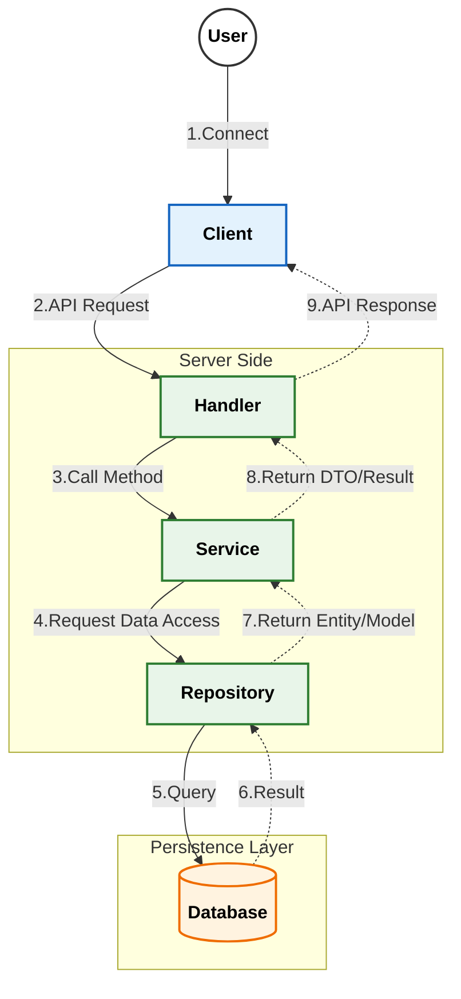
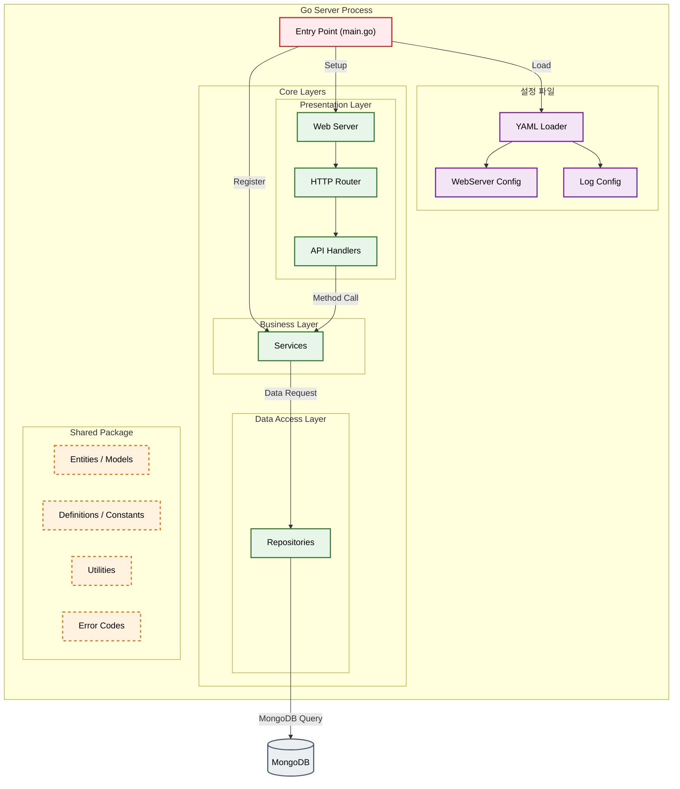

# MScannot206Server&nbsp; 

이 프로젝트는 [MScannot206](https://github.com/dek0058/MScannot206) 클라이언트를 보조하기 위한 콘솔 서버 입니다.

## 목차

- [📋 요구사항](#-요구사항)
- [⚙️ 설정 파일](#️-설정-파일)
- [📚 API Documentation](#-api-documentation)
- [🏗️ 아키텍처](#️-아키텍처)
- [🖥️ 테스트 클라이언트](#️-테스트-클라이언트)

## 📋 요구사항

- Go [(다운로드 링크)](https://go.dev/doc/install)
- MongoDB [(다운로드 링크)](https://www.mongodb.com/try/download/community)


## ⚙️ 설정 파일

서버는 실행 시 `config.yaml` 파일에서 설정을 불러옵니다. 이 파일은 서버의 동작 방식을 제어하는 중요한 값들을 포함하고 있습니다.

실행파일과 동일한 디렉토리에 아래 예시와 같은 이름의 `config`파일이 존재한다면 자동으로 로드 됩니다.

만약 그렇지 않다면 `logconfig {path}`, `serverconfig {path}` 플래그를 통해 설정 파일의 경로를 지정할 수 있습니다.

(테스트 클라이언트의 경우 `logconfig {path}`, `config {path}` 플래그 사용 합니다.)


### 웹 서버 설정 (`server_config`)

웹 서버 및 데이터베이스 연결과 관련된 설정입니다.

| 키              | 타입     | 설명                                            |
| --------------- | -------- | ----------------------------------------------- |
| `port`          | `uint16` | 서버가 리스닝할 포트 번호입니다.                |
| `server_name`   | `string` | 서버의 이름입니다.                              |
| `locale`        | `string` | 서버의 로케일 설정입니다 (예: "ko-KR", "en-US"). |
| `mongo_uri`     | `string` | MongoDB 연결을 위한 URI입니다.                  |
| `mongo_env_db_name` | `string` | MongoDB에서 사용할 설정 관련 데이터베이스 이름입니다.     |

### 로그 설정 (서버: `server_log_config`, 테스트클라이언트: `testclient_log_config`)

서버의 로깅 시스템에 대한 설정입니다.

| 키              | 타입     | 설명                                                                    |
| --------------- | -------- | ----------------------------------------------------------------------- |
| `app_name`      | `string` | 로그에 기록될 애플리케이션의 이름입니다.                                |
| `log_dir`       | `string` | 로그 파일이 저장될 디렉토리입니다. 비어있을 경우, 실행 경로에 저장됩니다. |
| `max_file_size` | `int64` | 로그 파일의 최대 크기(MB)입니다. 0으로 설정 시 기본값이 사용됩니다.      |
| `debug_mode`    | `boolean`| `true`로 설정 시, 디버그 레벨 로그가 콘솔에 함께 출력됩니다.              |

### 테스트 클라이언트 설정 (`testclient_config`)

테스트 클라이언트의 기본 설정입니다.

| 키                  | 타입     | 설명                                            |
| ------------------- | -------- | ----------------------------------------------- |
| `url`               | `string` | 테스트 클라이언트가 접속할 서버의 URL입니다.   |
| `port`              | `uint16` | 테스트 클라이언트가 접속할 서버의 포트 번호입니다. |

## 📚 API Documentation

상세한 API 명세는 아래 문서들을 참고해주세요.

- [🔐 로그인/인증 API (Login)](document/api/login.md)
- [👤 유저/캐릭터 API (User)](document/api/user.md)

## 🏗️ 아키텍처

### 메인



### 서버 구조



### 상세 플로우
- [로그인/인증](document/architecture/auth_flow.md) - 서버의 로그인 및 인증 처리 흐름
- [유저/캐릭터 관리](document/architecture/user_flow.md) - 유저의 캐릭터 생성, 삭제 등의 처리 흐름

## 🖥️ 테스트 클라이언트

테스트 목적으로 제작된 간단한 콘솔 클라이언트가 포함되어 있습니다. 해당 클라이언트는 `pkg/testclient` 디렉토리에서 확인할 수 있습니다.

### 기본 상태 명령어
```console
사용 가능한 명령어 목록:
    -help, -?, -h                          : 도움말 출력
    -exit, -quit, -q                       : 프로그램 종료
    -login <uid>                           : 로그인을 요청 합니다.
    -user_select <uid>                     : 로그인 된 유저를 선택 합니다.
```

### 유저 선택시 명령어
```console
사용 가능한 명령어 목록:
    -help, -?, -h                           : 도움말 출력
    -exit, -quit, -q                        : 선택 된 유저 선택 해제
    -character_list                         : 캐릭터 리스트를 요청 합니다.
    -character_delete <slot:number>         : 캐릭터 삭제를 요청 합니다.
    -character_create <slot:number> <name>  : 캐릭터 생성을 요청 합니다.
```
