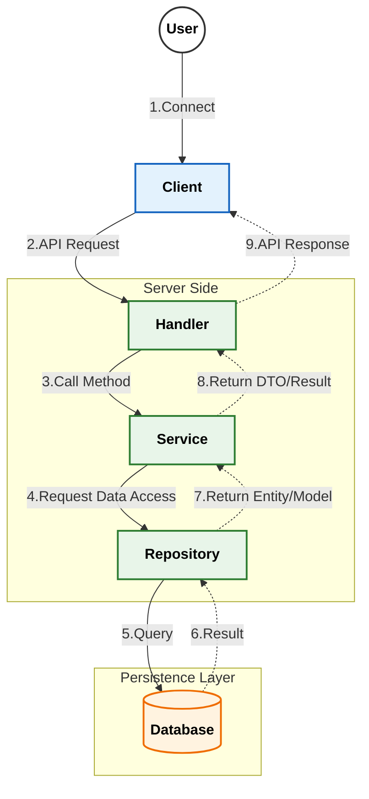
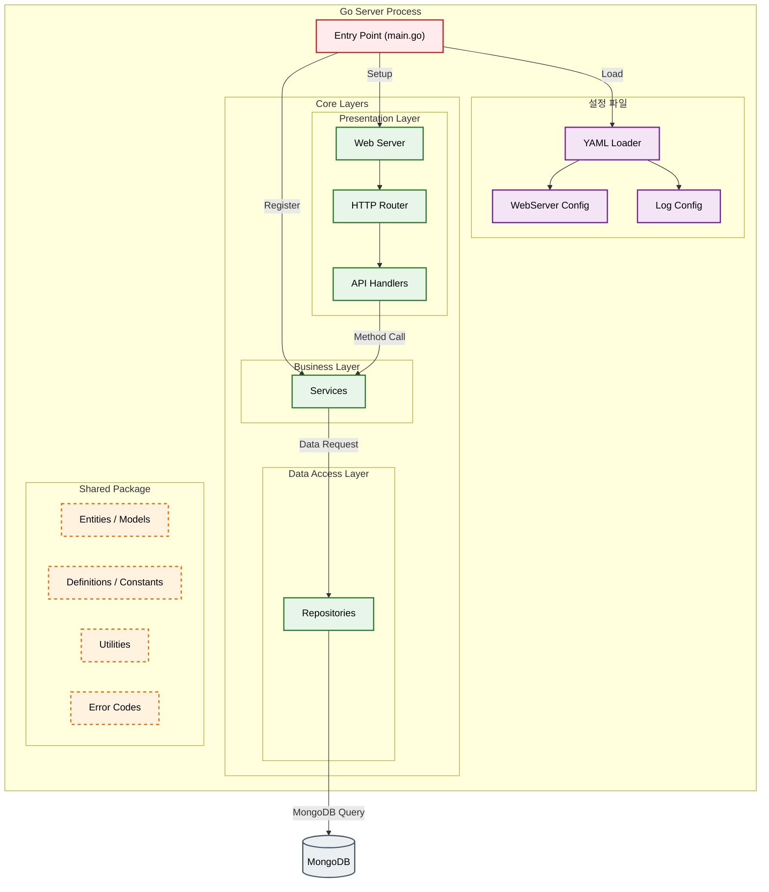

# MScannot206Server&nbsp; 

이 프로젝트는 [MScannot206](https://github.com/dek0058/MScannot206) 클라이언트를 보조하기 위한 콘솔 서버 입니다.

[메이플스토리 월드 크리에이터 이용약관](https://github.com/dek0058/MScannot206)을 준수하며, 해당 프로젝트는 비공식 프로젝트임을 알립니다.


## 목차

- [📋 요구사항](#-요구사항)
- [📚 API Documentation](#-api-documentation)
- [🏗️ 아키텍처](#️-아키텍처)
- [🖥️ 테스트 클라이언트](#️-테스트-클라이언트)

## 📋 요구사항

- Go [(다운로드 링크)](https://go.dev/doc/install)
- MongoDB [(다운로드 링크)](https://www.mongodb.com/try/download/community)


## 📚 API Documentation

상세한 API 명세는 아래 문서들을 참고해주세요.

- [🔐 로그인/인증 API (Login)](document/api/login.md)
- [👤 유저/캐릭터 API (User)](document/api/user.md)

## 🏗️ 아키텍처

### 메인



### 서버 구조



### 상세 플로우
- [로그인/인증](document/architecture/auth_flow.md) - 서버의 로그인 및 인증 처리 흐름
- [유저/캐릭터 관리](document/architecture/user_flow.md) - 유저의 캐릭터 생성, 삭제 등의 처리 흐름

## 🖥️ 테스트 클라이언트

테스트 목적으로 제작된 간단한 콘솔 클라이언트가 포함되어 있습니다. 해당 클라이언트는 `pkg/testclient` 디렉토리에서 확인할 수 있습니다.

### 기본 상태 명령어
```console
사용 가능한 명령어 목록:
    -help, -?, -h                          : 도움말 출력
    -exit, -quit, -q                       : 프로그램 종료
    -login <uid>                           : 로그인을 요청 합니다.
    -user_select <uid>                     : 로그인 된 유저를 선택 합니다.
```

### 유저 선택시 명령어
```console
사용 가능한 명령어 목록:
    -help, -?, -h                           : 도움말 출력
    -exit, -quit, -q                        : 선택 된 유저 선택 해제
    -character_list                         : 캐릭터 리스트를 요청 합니다.
    -character_delete <slot:number>         : 캐릭터 삭제를 요청 합니다.
    -character_create <slot:number> <name>  : 캐릭터 생성을 요청 합니다.
```
