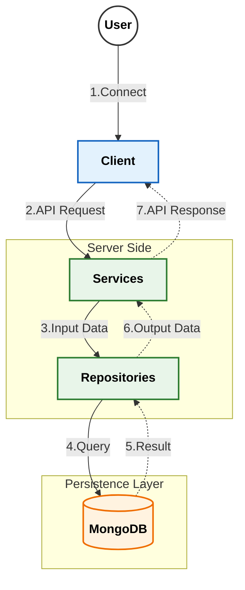

# MScannot206Server&nbsp; 

이 프로젝트는 [MScannot206](https://github.com/dek0058/MScannot206) 클라이언트를 보조하기 위한 콘솔 서버 입니다.

[메이플스토리 월드 크리에이터 이용약관](https://github.com/dek0058/MScannot206)을 준수하며, 해당 프로젝트는 비공식 프로젝트임을 알립니다.

## 📋 요구사항

 - [Go](https://go.dev/doc/install)
 - [MongoDB](https://www.mongodb.com/try/download/community)

## 📚 API Documentation

상세한 API 명세는 아래 문서들을 참고해주세요.

- [🔐 로그인/인증 API (Login)](document/login.md)
- [👤 유저/캐릭터 API (User)](document/user.md)

## 🏗️ 메인 아키텍처

